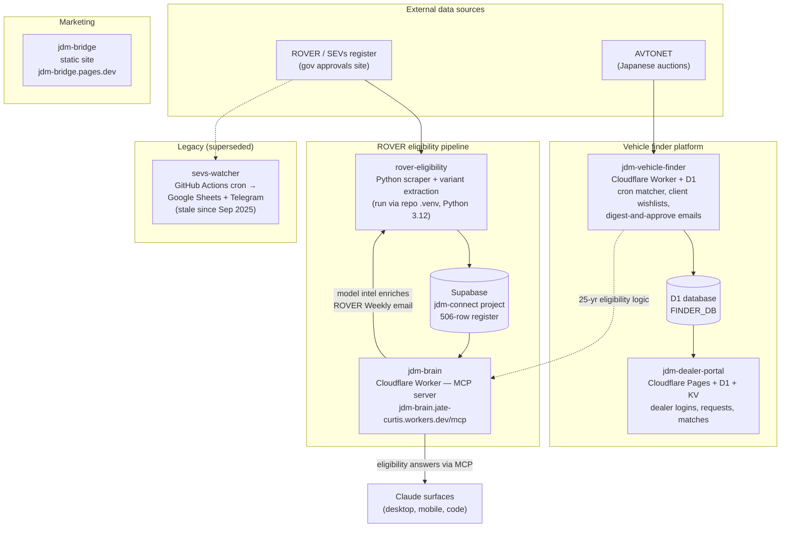
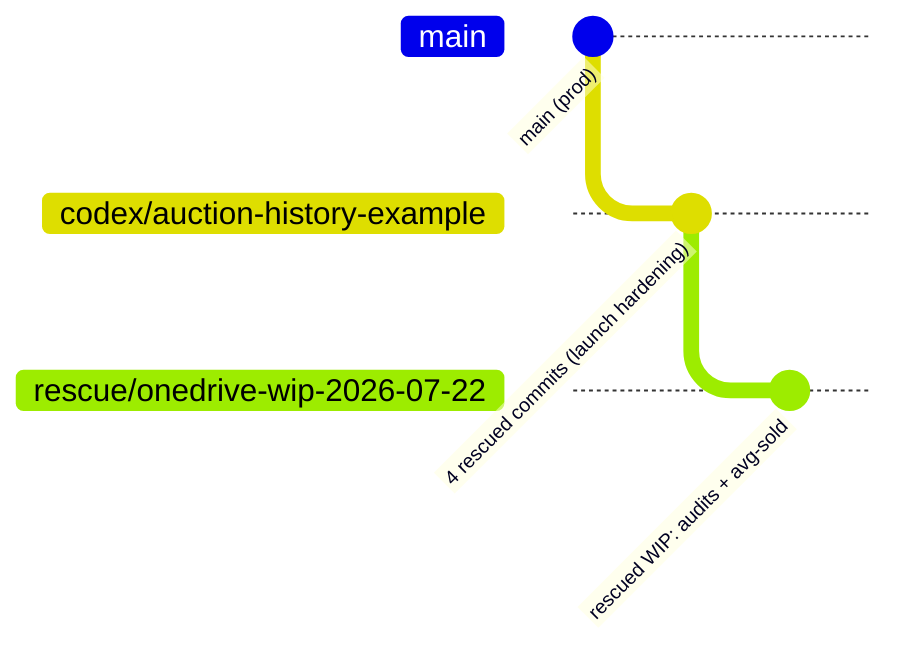
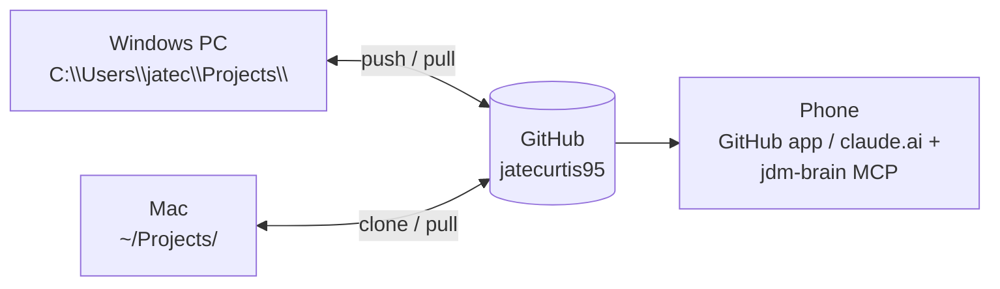

# JDM Connect — System Architecture & Project Map

> **Canonical rule:** all code lives in `C:\Users\jatec\Projects\` on this PC, and **GitHub (`jatecurtis95`) is the source of truth**. On any other machine (Mac, other PC), clone from GitHub — never copy folders, never work inside OneDrive.
>
> Last updated: 2026-07-22

## The big picture

## Where every project lives

| Project | Local folder (this PC) | GitHub | Deployed at | Status |
|---|---|---|---|---|
| **jdm-vehicle-finder** | `Projects\jdm-vehicle-finder` | `jatecurtis95/jdm-vehicle-finder` | Cloudflare Worker (push to main = prod deploy) | ACTIVE — core platform |
| **rover-eligibility** | `Projects\rover-eligibility-local` | `jatecurtis95/rover-eligibility` | Cloudflare Pages + Supabase | ACTIVE — data pipeline |
| **jdm-brain** | `Projects\jdm-brain` | `jatecurtis95/jdm-brain` | `jdm-brain.jate-curtis.workers.dev/mcp` | ACTIVE — MCP server |
| **jdm-dealer-portal** | `Projects\jdm-dealer-portal` | `jatecurtis95/jdm-dealer-portal` | Cloudflare Pages | Quiet since 22 Jun |
| **jdm-bridge** | `Projects\jdm-bridge` | ⚠️ needs `gh repo create` + push | `jdm-bridge.pages.dev` (CF Pages, jdmconnect acct) | ACTIVE — git initialised 22 Jul, not yet on GitHub |
| **sevs-watcher** | `Projects\sevs-watcher` | `jatecurtis95/sevs-watcher` | GitHub Actions cron | LEGACY — superseded by rover-eligibility |
| teefinder-app | `Projects\teefinder-app` | `jatecurtis95/teefinder` | — | Separate business |
| fairway-society | `Projects\fairway-society` | `jatecurtis95/fairway-society` | — | Separate project |

**GitHub-only repos (no local checkout needed):** `JDMCAuctionsearch`, `JDMC_Dashboard`, `jdm-asnet-scraper`, `jdm-calculator`, `jdm-ops-hub` — older/archived projects. Clone on demand.

## Branch map — jdm-vehicle-finder

- `main` — production; pushing deploys.
- `codex/auction-history-example` — 4 launch-hardening commits rescued from the OneDrive clone (22 Jul 2026). Review & merge or discard.
- `rescue/onedrive-wip-2026-07-22` — 21 files of uncommitted work rescued from the OneDrive clone (CODE_AUDIT.md, FLOW_AUDIT.md, UI_AUDIT.md, `scripts/avg-sold.mjs` + test, launch-control edits). Review & cherry-pick.
- Local untracked in main worktree: audit docs + `scripts/avg-sold.mjs` (duplicated in rescue branch), `package.json` modified — decide and commit.

## Working from another machine

1. **Mac / other PC:** `git clone https://github.com/jatecurtis95/<repo>.git ~/Projects/<repo>` — then always `git pull` before working and `git push` when done.
2. **Phone:** browse code via the GitHub app; ask eligibility questions via the jdm-brain MCP connector in claude.ai.
3. **Never** edit code inside OneDrive — the July 2026 migration moved all code out of it deliberately (git + OneDrive sync corrupts repos).

## Deprecated / do-not-use locations

| Location | What it is | Action |
|---|---|---|
| `OneDrive\Documents\JDM Finder` | Old second clone of jdm-vehicle-finder | Work rescued to branches 22 Jul → delete folder |
| `OneDrive\Claude\Apps & Code\rover_data` | Pre-repo rover scraper working dir (last touched 11 Jun) | Superseded by `rover-eligibility` repo → archive |
| `OneDrive\Claude\Apps & Code\jdm-import-bot` | Old Vercel import bot (8 Jun) | Archive or repo-ify if still wanted |
| `OneDrive\Claude\Apps & Code\jdm-ops-hub` | Old clone; repo exists on GitHub | Delete local, clone fresh if needed |
| `Projects\JDMCAuctionsearch.worktrees` | Dead worktree; base repo moved to `_MIGRATION_2026-07-06` backup | Delete after eyeballing |
| `Projects\jdm-finder-v13`, `Projects\jdm-share-links` | Leftover worktrees, branches already merged to main | `git worktree remove` (~400 MB back) |
| `Downloads\rover-eligibility-main.zip`, `Eligibility prototype…zip` | Stale snapshots (Jun 2026) | Delete |
| `C:\Users\jatec\JDMFinder-backups` | Two pre-ledger D1 SQL dumps (13 Jul) | Keep until ledger migration confirmed good |
