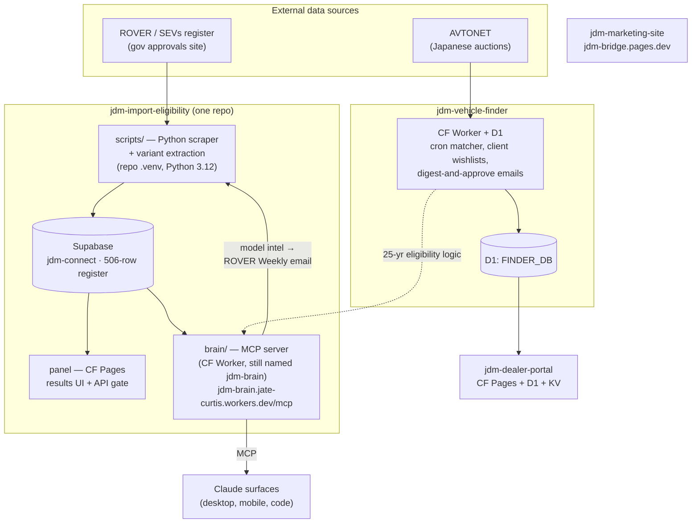
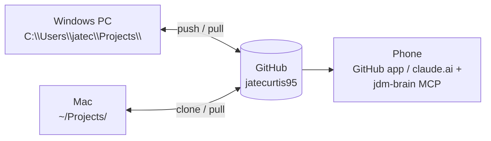

# JDM Connect — System Architecture & Project Map

> **Canonical rule:** all code lives in `C:\Users\jatec\Projects\` on this PC, and **GitHub (`jatecurtis95`) is the source of truth**. On any other machine (Mac, other PC), clone from GitHub — never copy folders, never work inside OneDrive.
>
> Last updated: 2026-07-22 (post-rename & eligibility merge)

## The four repos

| Repo & local folder | What it is | Deploys to |
|---|---|---|
| **jdm-vehicle-finder** | Core platform — AVTONET auction matcher, client wishlists, digest-and-approve emails. CF Worker + D1. ⚠️ push to main = production deploy | Cloudflare Worker |
| **jdm-import-eligibility** | Everything eligibility, one repo: `scripts/` Python ROVER scraper · `functions/` + root = Pages results panel · `supabase/` migrations · `brain/` MCP server (worker keeps the name `jdm-brain` so the MCP URL never changes) | CF Pages + Supabase + CF Worker |
| **jdm-dealer-portal** | Dealer logins, requests & matches. Reads the finder's D1 (`FINDER_DB`) | Cloudflare Pages |
| **jdm-marketing-site** | JDM Bridge marketing site (Perth) | jdm-bridge.pages.dev |

**Archived (read-only on GitHub, clone if ever needed):** `jdm-brain` (merged into jdm-import-eligibility), `sevs-watcher` (superseded), `JDMCAuctionsearch`, `JDMC_Dashboard`, `jdm-asnet-scraper`, `jdm-calculator`, `jdm-ops-hub`.

## The big picture

## Branch map — jdm-vehicle-finder

- `main` — production; pushing deploys.
- `codex/auction-history-example` — 4 launch-hardening commits rescued from the OneDrive clone (22 Jul). Review & merge or discard.
- `rescue/onedrive-wip-2026-07-22` — 21 rescued WIP files (audits, avg-sold script, launch-control edits). Review & cherry-pick.

## Working from another machine

1. **Mac / other PC:** `git clone https://github.com/jatecurtis95/<repo>.git ~/Projects/<repo>` — `git pull` before working, `git push` when done. Old repo URLs auto-redirect after the renames.
2. **Phone:** GitHub app for code; jdm-brain MCP connector in claude.ai for eligibility questions.
3. **Never** edit code inside OneDrive — git + OneDrive sync corrupts repos.

## Deploy notes

- **Finder:** push to `main` = production. Treat main as sacred.
- **Eligibility panel (Pages):** repo layout unchanged at root, so the Pages build config carries over the rename.
- **Brain (Worker):** deploy from `brain/`: `cd brain && npm install && npx wrangler deploy`. Worker name stays `jdm-brain` — do not rename it or the claude.ai MCP connector URL breaks.
- **Marketing site:** CF Pages (jdmconnect account), currently manual.

## Cleanup queue — deprecated locations

| Location | Status |
|---|---|
| `OneDrive\Documents\JDM Finder` | Work rescued 22 Jul → delete folder after pushing rescue branches |
| `OneDrive\Claude\Apps & Code\{rover_data, jdm-import-bot, jdm-ops-hub}` | Superseded → archive/delete |
| `Projects\jdm-finder-v13`, `Projects\jdm-share-links`, `.worktrees\requests-customers-unify` | Merged worktrees → `git worktree remove` (~400 MB) |
| `Projects\JDMCAuctionsearch.worktrees` | Dead worktree (base repo in `_MIGRATION_2026-07-06` backup) → delete after a glance |
| `Projects\jdm-brain` folder | Merged into jdm-import-eligibility → delete local folder after merged repo is pushed |
| `Downloads\rover-eligibility-main.zip`, `Eligibility prototype…zip` | Stale snapshots → delete |
| `Downloads\JDM Connect\sevs-monitor-*.json` | ⚠️ GCP service-account key → **rotate, then delete** |
| `C:\Users\jatec\JDMFinder-backups` | Pre-ledger D1 dumps → keep until ledger migration verified |
